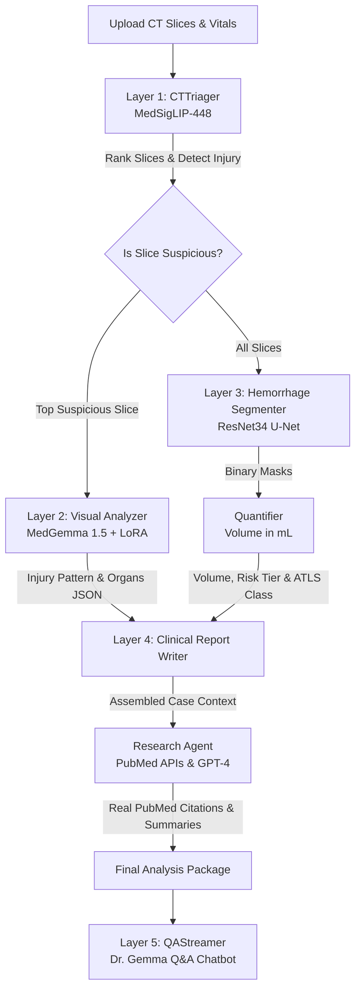

# Trauma Lifesaver: AI-Powered CT Triage & Clinical Decision Support

> [!WARNING]
> **PROTOTYPE DECISION SUPPORT SYSTEM ONLY — NOT FOR CLINICAL OR DIAGNOSTIC USE**
> This software is an experimental prototype designed for educational, academic review, and peer-evaluation purposes only. It is **intended for personal use only** under a strict proprietary license. See the [LICENSE](LICENSE) file for complete details and mandatory fork notification terms.

Trauma Lifesaver is an advanced, multi-layer AI pipeline designed to automate the triage, segmentation, quantification, and clinical reporting of acute abdominal trauma from CT slice series. By combining vision-language models, specialized pixel-level segmenters, deterministic clinical logic, and real-time biomedical literature retrieval, the system provides emergency clinicians with rapid, reliable, and evidence-grounded decision support during high-pressure trauma resuscitation.

---

## Why It Is Used

In acute trauma care (e.g., high-impact motor vehicle accidents, falls, or penetrating wounds), **blunt abdominal trauma** is a leading cause of preventable mortality due to occult internal bleeding. 
* **Time-Critical Triage**: Manually reviewing hundreds of CT slices can delay treatment. Trauma Lifesaver screens slice series in seconds to flag high-risk pathologies.
* **Objective Quantification**: Estimating hemorrhage volume by eye is highly subjective. The integrated U-Net segmenter computes blood volume in milliliters (mL) to guide resuscitation protocols.
* **Standardized Clinical Reports**: Synthesizes structured reports aligning findings with **AAST grading** and **EAST guidelines**, ensuring trauma surgeons have consistent and actionable summaries.
* **Evidence Grounding**: Prevents AI hallucination by fetching and summarizing real-world PubMed literature specific to the patient's presentation.

---

## What's New

Unlike monolithic vision-language systems or single-task segmentation models, Trauma Lifesaver introduces:
1. **Five-Layer Hybrid Architecture**: Seamlessly coordinates specialized models: **MedSigLIP** (fast zero-shot screening), **U-Net** (dense segmentation), **MedGemma 1.5** (multimodal clinical reasoning), and **GPT-4** (PubMed evidence synthesis).
2. **MedGemma 1.5 LoRA Adapter**: Fine-tuned on the RSNA 2023 Abdominal Trauma dataset (`jayantsom/medgemma-1v5-4b-it-rsna23-abd-ct-peft-lora-r16-a32-ep3-lr2e4-v1`) to specialize Gemma's reasoning on trauma imaging.
3. **Deterministic-LLM Hybrid Reporting**: The clinical report structure (AAST grades, EAST guidelines) is generated deterministically to ensure stability, while MedGemma generates narrative impressions and actions.
4. **Dr. Gemma Chatbot with SSE**: A real-time, streaming clinical Q&A chatbot that strips model "thinking blocks" and answers patient-specific clinical queries using the grounded report and cited PubMed abstracts.

---

## Technology Stack

The application is built using a modern, lightweight, yet highly optimized medical AI stack:

* **Frontend Dashboard**:
  * **HTML5 & Vanilla Javascript (ES6)**: Handles drag-and-drop file upload, real-time status polling, and client-side PDF downloads.
  * **CSS3 Variables & Grid**: Features a fully responsive dashboard with glassmorphism aesthetics, dynamic dark/light mode, and live analysis step trackers.
  * **Server-Sent Events (SSE)**: For low-latency token streaming from the clinical Q&A assistant.
* **Backend Framework**:
  * **Flask (Python)**: Light backend orchestrator serving static templates, handling background job dispatching via daemon threads, and exposing clean JSON endpoints.
* **Deep Learning & Inference**:
  * **PyTorch**: Backing tensor computations and CUDA-accelerated operations.
  * **Hugging Face Transformers & PEFT**: Runs zero-shot `MedSigLIP` and manages `MedGemma 1.5` 4-bit load with `BitsAndBytesConfig` + LoRA adapter integration.
  * **Segmentation Models PyTorch (SMP)**: ResNet-34 backboned U-Net for dense semantic segmentation of hemorrhages.
* **Report Generation**:
  * **ReportLab**: Programmatically compiles clinical findings, AAST grades, and PubMed references into a download-ready PDF document.
* **Agentic Research Layer**:
  * **NCBI Entrez E-Utilities**: Direct API access (`esearch` + `efetch`) for live PubMed query execution.
  * **OpenAI API**: Orchestrates `gpt-4.1-mini` for clinical summarization, citation matching, and grounded clinical Q&A.

---

## Detailed Pipeline Architecture

The system operates through a sequential five-layer pipeline coordinated by the `TraumaPipeline` orchestrator:



### The Five-Layer Pipeline Breakdown:
1. **Layer 1: CTTriager (`pipeline/layer_1_ct_triager.py`)**: Utilizes `google/medsiglip-448` to score and rank slices against trauma labels. The highest-risk slice is passed downstream, avoiding GPU out-of-memory (OOM) errors.
2. **Layer 2: CTVisualAnalyzer (`pipeline/layer_2_ct_analyzer.py`)**: Employs `google/medgemma-1.5-4b-it` (with 4-bit quantization and LoRA) to output structured findings about organ involvement and injury patterns.
3. **Layer 3: HemorrhageSegmenter (`pipeline/layer_3_hemorrhage_segmenter.py`)**: Performs dense pixel-level segmentation across all slices using a custom-trained U-Net.
4. **Quantifier (`pipeline/quantifier.py`)**: Calculates hemorrhage volume in mL based on pixel spacing (default `0.5 x 0.5 x 3.0 mm`), returning ATLS shock classes and risk tiers.
5. **Layer 4: ClinicalReportWriter (`pipeline/layer_4_report_writer.py`)**: Assembles the findings into a report with AAST grading, EAST recommendations, and MedGemma-completed impressions.
6. **Research Agent (`pipeline/research_agent.py`)**: Searches PubMed via NCBI Entrez APIs using dynamically generated queries, filters/ranks papers, and uses OpenAI to add enhanced clinical explanations and citations.
7. **Layer 5: QAStreamer (`pipeline/layer_5_qa_streamer.py`)**: Streams answers to user questions via the chatbot, using either OpenAI (grounded in context) or local MedGemma.

---

## System Workflow & Execution Steps

The backend handles incoming analysis requests through a non-blocking background queue to keep the Flask UI responsive. Below is the step-by-step process of a single analysis execution:

### 1. Request Ingestion & Parsing
* **Inputs**: The user uploads multiple axial abdominal CT slices (PNG/JPEG) and optionally inputs vital signs (Heart Rate, Blood Pressure, GCS) and clinical notes.
* **Initialization**: The Flask server creates a unique `job_id`, stages the images in the `uploads/` directory, initializes an in-memory job tracker, and spawns a daemon thread to orchestrate the pipeline without blocking the main event loop.

### 2. Layer 1 — High-Speed Triage & Filtering
* The `CTTriager` runs the slices through `google/medsiglip-448` to calculate zero-shot probability scores against target trauma labels (e.g., active bleeding, solid organ injury, normal).
* Slices are ranked by their suspicion scores. The single most suspicious slice is isolated and staged for MedGemma visual analysis. This down-sampling prevents GPU Out-Of-Memory (OOM) failures.

### 3. Parallel Segmentation & Multimodal Reasoning
* **Pixel Segmentation (Layer 3)**: All uploaded slices are processed through the ResNet-34 U-Net model. It generates a 2D binary mask of detected blood pools for each slice.
* **Visual Interpretation (Layer 2)**: The primary suspicious slice is fed to the fine-tuned `MedGemma 1.5` model. MedGemma outputs a structured JSON document detailing the injury pattern, affected organs, bleeding description, and differential diagnoses.

### 4. Volume Quantification & Severity Classing
* The `Quantifier` takes the combined 3D stack of binary segmentation masks and calculates the total bleeding volume in milliliters ($mL$) using the voxel dimensions:
  $$\text{Volume } (mL) = \text{Voxel Count} \times \left( \frac{\text{dx}}{10} \times \frac{\text{dy}}{10} \times \frac{\text{dz}}{10} \right)$$
* The calculated volume is mapped to standard clinical categories:
  * **ATLS Shock Classification**: Class I ($<750$ mL) through Class IV ($>2000$ mL).
  * **Hemorrhage Risk Level**: LOW ($<10$ mL), MODERATE ($10-500$ mL), or HIGH ($>500$ mL).

### 5. Layer 4 — Clinical Report Synthesis
* The `ClinicalReportWriter` aggregates the outputs:
  * Generates the *Clinical Indication* from raw patient notes.
  * Writes the *Findings* section deterministically, combining triage peak scores, organ involvement list, and the computed volume.
  * Estimates *AAST Grades* (I through IV) per involved organ based on volume and risk.
  * Calls `MedGemma` to synthesize a concise, natural-language *Clinical Impression*, urgent *Physician Actions*, and required *Labs*.
  * Integrates the formal *EAST Guidelines* corresponding to the patient's risk level.

### 6. Background Literature Enhancement (Research Agent)
* The `ResearchAgent` constructs search queries using the patient's age, anatomical locations, and identified injuries.
* Executes searches against the NCBI PubMed database using Entrez APIs, retrieving abstracts and metadata for the top matches.
* Ranks matching articles based on case relevance, filters out unrelated topics (e.g. pediatric papers for adult cases or neurotrauma for abdominal cases), and calls the OpenAI API to write an *Agentic Clinical Explanation* citing real PMIDs.

### 7. Interactive Q&A & Streaming (Layer 5)
* The structured results, citations, and images are stored in a memory cache mapped to a `session_id`.
* The frontend results page renders the data and enables a floating chat window. When the user asks a question, the `QAStreamer` queries `MedGemma` or `OpenAI` (using the cached report context as a grounding system), strips any internal reasoning tokens, and streams the answer back to the UI.

---

## How to Setup Local

### Prerequisites
* Windows or Linux OS
* Python 3.10 or 3.11
* NVIDIA GPU (Recommended, 8GB+ VRAM for quantized inference, 16GB+ for unquantized)
* Hugging Face Account & Access to MedGemma

### Step-by-Step Installation
1. **Clone the Repository**:
   ```bash
   git clone https://github.com/jayantsom/Trauma_Lifesaver.git
   cd Trauma_Lifesaver
   ```
2. **Set Up a Virtual Environment**:
   ```powershell
   python -m venv venv
   .\venv\Scripts\Activate
   ```
3. **Install Dependencies**:
   ```bash
   pip install -r requirements.txt
   ```
4. **Configure Environment Variables**:
   Create a `.env` file in the root directory:
   ```env
   HF_TOKEN=hf_your_huggingface_read_token
   OPENAI_API_KEY=sk-proj-your_openai_api_key_for_research_agent
   NCBI_API_KEY=your_ncbi_entrez_api_key_for_pubmed
   CPU_SAFE_MODE=false # Set to true to bypass MedGemma load on low-resource machines
   PORT=7860
   ```
5. **Run the Application**:
   ```bash
   python app.py
   ```
   Access the dashboard at `http://localhost:7860`.

---

## How to Setup Online

### Option A: Google Colab (Recommended for Free GPU Access)
1. Open a new Google Colab notebook with a **T4 GPU** runtime.
2. Copy and execute the cells defined in [colab_runner.py](colab_runner.py):
   * Clone the repo and install packages.
   * Configure environment variables (HF, OpenAI, and NCBI keys).
   * Launch the Flask server and run a Cloudflare Tunnel using `cloudflared` to expose a secure public URL.

### Option B: Docker Container
1. **Build the Docker Image**:
   ```bash
   docker build -t trauma-lifesaver .
   ```
2. **Run the Container**:
   Pass your tokens as environment variables:
   ```bash
   docker run -d -p 7860:7860 \
     -e HF_TOKEN="your_hf_token" \
     -e OPENAI_API_KEY="your_openai_key" \
     -e NCBI_API_KEY="your_ncbi_key" \
     --gpus all \
     trauma-lifesaver
   ```

---

## Trainings

The repository contains scripts and Jupyter notebooks to train/fine-tune the core ML models:

### 1. MedGemma 1.5 LoRA Fine-Tuning
* **Script**: `training/optimized_lora_finetune.py`
* **Notebook**: `training/Finetune_run_lora_medgemma.ipynb`
* **Dataset**: `jherng/rsna-2023-abdominal-trauma-detection` (RSNA 2023 Kaggle dataset)
* **Goal**: Teaches MedGemma 1.5 to output structured JSON responses containing injury details based on multiple CT slices. It saves memory by leveraging 4-bit QLoRA, gradient checkpointing, and page-8bit AdamW.

### 2. U-Net Hemorrhage Segmenter Training
* **Script**: `training/train_unet_segmenter.py`
* **Notebook**: `training/Finetune_run_unet_.ipynb`
* **Goal**: Trains a ResNet-34 U-Net model on 2.5D CT slices using a combination of Dice and Binary Cross Entropy (DiceBCE) loss to accurately segment bleeding regions.

---

## Future Scope

* **Vector Database Integration**: Implement local vector embeddings (using ChromaDB or FAISS) to cache and index PubMed papers for rapid, offline literature matching.
* **3D Volumetric Segmentation**: Upgrade the U-Net from 2.5D slices to a true 3D architecture (e.g., Swin UNETR) to analyze entire NIfTI files natively.
* **Direct DICOM Support**: Enable parsing of raw medical DICOM files directly in the frontend upload interface, pulling metadata (spacing, patient info) automatically from headers.
* **Anatomical Expansion**: Extend model training to include pelvic fractures, thoracic trauma, and intracranial hemorrhages for a comprehensive whole-body triage suite.

---

## License & Intended Use

This project is **intended for personal use, academic evaluation, and peer review only**. It is governed by a proprietary and source-available license. 

* **Mandatory Fork Notification**: If you fork this repository, you are contractually obligated to email the Copyright Holder at **jayant4195@gmail.com** with your fork URL and intent.
* **No Commercial Use**: Integration into commercial pipelines or clinical trials is strictly prohibited without a separate commercial agreement.
* See [LICENSE](LICENSE) for the full license text, attribution guidelines, and contact details.

---

## Author & Contact

Developed by **Jayant Som**.
* **LinkedIn**: [Jayant Som](https://www.linkedin.com/in/jayantsom)
* **Email**: [jayant4195@gmail.com](mailto:jayant4195@gmail.com)

